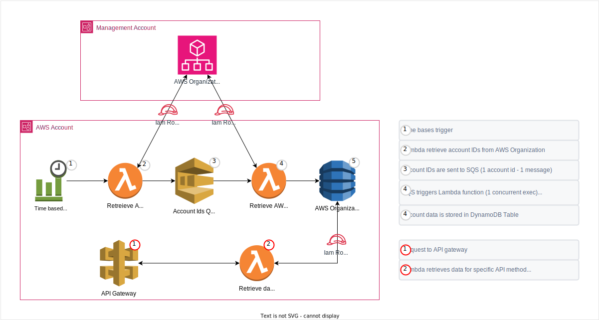

# AWS Organization Metadata API

This project provides a secure, scalable, and efficient way to expose AWS Organizational data through an AWS API Gateway. The setup is intended to be deployed across two AWS accounts for optimal security and functionality.

## Project Rationale: Enhancing Efficiency and Security in AWS Organization Management

### Addressing API Throttling and Speed Constraints

When interfacing with AWS Organizations' APIs, users often encounter throttling limits that can severely limit the ability to gather organizational data. These limitations are exacerbated in large enterprises with numerous accounts and resources. Our project adeptly navigates these restrictions by implementing an intelligent request batching system and data-fetching strategy within a serverless framework, thereby maintaining efficiency while adhering to AWS's fair usage policies.

### Speedy and Efficient Data Retrieval

Traditional methods of extracting data from AWS Organizations can be time-consuming and resource-intensive. Our approach circumvents these issues by:

1. **Caching AWS Organizational Data**: Data is stored in a DynamoDB table, creating a rapid-access cache that significantly cuts down data retrieval times.
2. **Optimized Data Structures**: The table design incorporates strategic indexing to facilitate swift and complex queries, minimizing the processing time for data retrieval.

### Minimizing Latency

Deployed within AWS, our system capitalizes on the low-latency environment, ensuring expedited access to AWS services and reducing network-induced delays.

### Continuous and Automated Data Collection

The system refreshes organizational data at regular intervals autonomously, which ensures the DynamoDB cache remains current and eliminates the need for manual updates.

### Elevating Security through Indirect Access

One of the paramount advantages of our system is the additional layer of security it introduces. Access to AWS Organization's account data is highly sensitive, particularly in the management account where privileged operations occur. Our solution mitigates direct exposure by removing the necessity for users to set up direct access to this sensitive account. Instead, it provides pre-processed and sanitized data via a secure API, significantly reducing the risk of inadvertent privilege escalation or security breaches. The management account remains insulated, while users interact with a securely constructed interface that respects least privilege principles and adheres to best practices for cross-account access.

### Advantages of the System

- **Robust Against Throttling**: Strategically spaced API requests prevent triggering AWS throttling, ensuring consistent data flow.
- **Quick Access**: Near-instantaneous data retrieval from the DynamoDB cache vastly improves the user experience.
- **Cost-Effective**: Reduced API call frequency can lead to lower costs in AWS service usage.
- **Automated and Up-to-Date**: Automated data collection workflows ensure that the organizational data is refreshed without manual intervention.
- **Security-First Approach**: By obviating the need for direct access to the management account, the system enhances the overall security posture, protecting sensitive operations and data.

In conclusion, our project provides a comprehensive solution to the challenges of managing and retrieving AWS Organizational data. It not only improves efficiency and reliability but also fortifies the security framework by reducing the direct interaction with the management account, a critical consideration for any enterprise operating in the cloud.




## Architecture Overview

- **Management Account**: Utilizes `master-role.yaml` to create a role that permits secure cross-account data collection.
- **AWS Account**: 
  - Data is collected daily via a Lambda function specified in `data-source.yaml`, which then stores it into a DynamoDB table designed for efficient retrieval.
  - The API Gateway, protected by an `x-api-key`, interfaces with another Lambda function to retrieve and pre-process the data. This is deployed using `api-gateway.yaml`.
  
It is a best practice to deploy the API Gateway and the data collection elements in a separate account from the management account.

## Security Overview

Our project employs AWS security best practices to safeguard cross-account interactions, primarily through the use of the `CrossAccountLambdaRole`. This IAM role enforces a stringent security model ensuring secure and controlled access to AWS resources.

### Role-Based Access Control

- **Cross-Account Access**: The `CrossAccountLambdaRole` is designed to be assumed by a trusted AWS Lambda service in a different account, allowing for secure cross-account operations.
- **Unique Security Identifier**: Access to assume the role requires a deployment-specific `sts:ExternalId`, providing a safeguard against unauthorized cross-account delegation.

### Principle of Least Privilege

- **Scoped Permissions**: The IAM role's permissions are tightly scoped to include only the necessary AWS Organizations actions such as listing accounts and organizational units. This enforces the principle of least privilege, restricting the role's capabilities to only what is essential for operation.

### Secure Policy Enforcement

- **Condition-Based Access**: The role's trust policy includes conditions that must be met when the `AssumeRole` action is invoked, ensuring that only requests with the correct `sts:ExternalId` are granted access.
- **Security Principals**: The role trust relationship is established with specific AWS principals, limiting who can assume the role based on predefined AWS account IDs.

### Continuous Security Practices

- **Regular Audits**: Security configurations and permissions are regularly audited to ensure compliance with the latest AWS security standards and practices.
- **Security Tags**: Tags such as `Environment` and `Role` are used to provide clear identification and context for the role within the AWS environment.

By incorporating these security mechanisms, the project ensures a secure architecture that mitigates risks while enabling necessary cross-account functionalities.

## Deployment Order

1. **master-role.yaml**: Sets up the cross-account role.
    - Outputs:
        - `CrossAccountRoleARN`
        - `CrossAccountRoleARNExternalId`
  
2. **data-source.yaml**: Establishes the data collection Lambda and DynamoDB.
    - Parameters:
        - `OrgCrossAccountRoleArn`
        - `CrossAccountRoleARNExternalId`
    - Outputs:
        - `OrgMetadataDynamoDBTable`

3. **api-gateway.yaml**: Configures the API Gateway to expose the collected data.
    - Parameters:
        - `OrgMetadataDynamoDBTable`
    - Outputs:
        - `ApiURL`

## Installation

The project can be installed using the AWS Management Console or the AWS CLI. 

### CLI Commands

The following commands can be used to deploy the respective templates:

#### Management account
```bash
aws cloudformation deploy \
  --template-file master-role.yaml \
  --stack-name master-role-stack \
  --parameter-overrides LambdaAccountId=<account_id>
```

#### API / Data account
```bash
aws cloudformation deploy \
    --template-file data-source.yaml \
    --stack-name data-source-stack \
    --parameter-overrides \
        ParameterKey=OrgCrossAccountRoleArn,ParameterValue=<value> \
        ParameterKey=ExternalID,ParameterValue=<value>

aws cloudformation deploy \
    --template-file api-gateway.yaml \
    --stack-name api-gateway-stack \
    --parameter-overrides \
        ParameterKey=OrgMetadataDynamoDBTable,ParameterValue=<value>
```

### Sample CURL Queries

To interact with the API, you can use the following CURL commands:

#### Accounts
```bash
curl --location 'https://[api-id].execute-api.[region].amazonaws.com/v1/aws-org-metadata/account/{account_ids}' \
        --header 'x-api-key: [your-api-key]'
```

#### Email
```bash
curl --location 'https://[api-id].execute-api.[region].amazonaws.com/v1/aws-org-metadata/email/{email}' \
        --header 'x-api-key: [your-api-key]'

```

#### Organizational Unit (OU)
```bash
curl --location 'https://[api-id].execute-api.[region].amazonaws.com/v1/aws-org-metadata/ou/{ou_ids}' \
        --header 'x-api-key: [your-api-key]'

```

#### Status
```bash
curl --location 'https://[api-id].execute-api.[region].amazonaws.com/v1/aws-org-metadata/status/{status}' \
        --header 'x-api-key: [your-api-key]'

```

#### Tag
```bash
curl --location 'https://[api-id].execute-api.[region].amazonaws.com/v1/aws-org-metadata/tag/{tag_name}/{tag_value}' \
        --header 'x-api-key: [your-api-key]'

```

#### Tags
```bash
curl --location 'https://[api-id].execute-api.[region].amazonaws.com/v1/aws-org-metadata/tags/{tags_query}' \
        --header 'x-api-key: [your-api-key]'

```

#### Example
```bash
curl --location 'https://[api-id].execute-api.[region].amazonaws.com/v1/aws-org-metadata/account/123456789012,098765432123' \
        --header 'x-api-key: [your-api-key]'

```

### Credits

Project developed by Tomek Klas.

For inquiries or contributions, please contact aws-org-metadata@tomekklas.com.

## License

This project is licensed under the Apache License 2.0.
